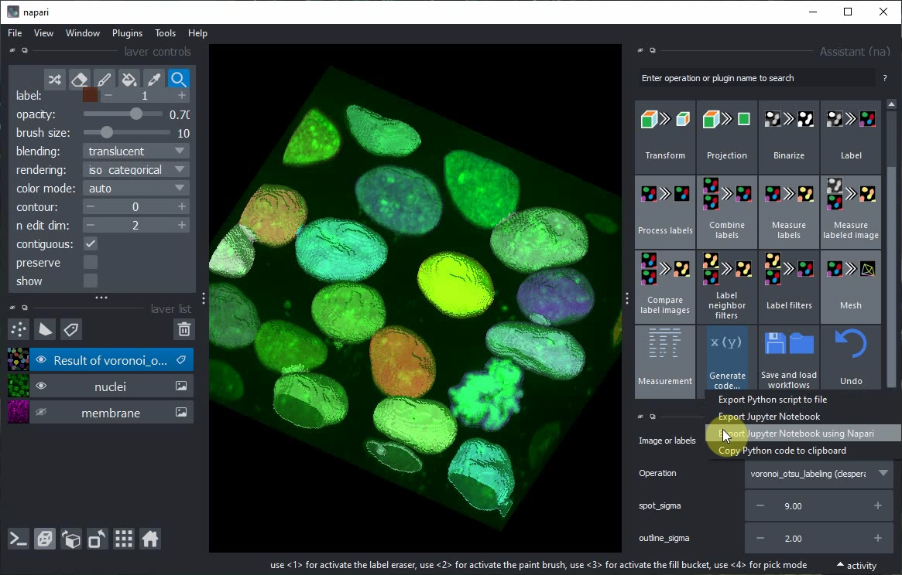
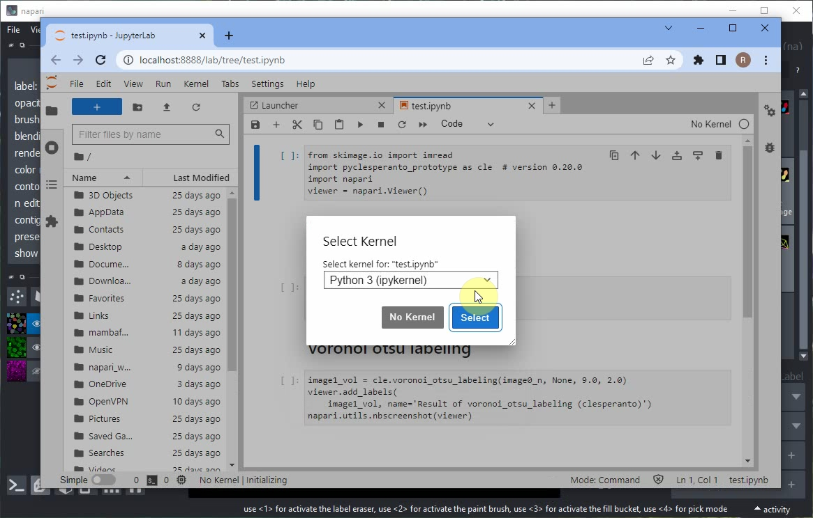

# Generating Jupyter Notebooks from the Napari Assistant

After setting  up a workflow using the Napari Assistant, we can export Python code, e.g. as Jupyter Notebook.

This tutorial is also available as video [export_notebooks.mp4](images/export_notebooks.mp4)

In the Assistant panel, click on the `Generate Code...` button and the `Export Jupyter Notebook using Napari` menu.

Jupyter lab will open and ask you to select a Kernel. Keep the default option and click on `Select`.

When executing the notebook, errors may appear, e.g. when loading the data. 

Uncomment the `imread` call and update the `filename` with the path to the nuclei image from the data folder `filename = '../data/nuclei.tif'`

Afterwards, rerun the notebook and inspect the result. The Napari viewer that opened in the background will also be shown within the notebook.

Voila! You have now generated a Jupyter Notebook from a Napari Assistant workflow. This notebook documents your work reproducibly and can be shared with others.